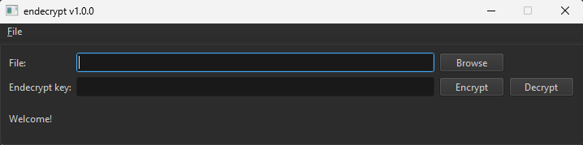

# Endecrypt
*Josh Bailey* 

## Contents
- [Endecrypt](#endecrypt)
  - [Contents](#contents)
  - [Overview](#overview)
  - [How to Use](#how-to-use)
    - [Encrypt](#encrypt)
    - [Decrypt](#decrypt)
    - [Output](#output)

## Overview
A very basic encryption/decryption application implementing the following: https://www.cryptopp.com/wiki/DefaultEncryptorWithMAC

## How to Use
### Encrypt
1) Enter the absolute path of the file you wish to encrypt. Alternatively use the file explorer by clicking the "Browse" button.
2) Enter an encryption key. Note: This key is not saved anywhere, if you forget it, you will NOT later be able to decrypt this file.
3) Click the "Encrypt" button to encrypt the file.

### Decrypt
1) Enter the absolute path of the file you wish to decrypt. Alternatively use the file explorer by clicking the "Browse" button.
2) Enter the decryption key. Note: This key MUST match what was used during file encryption.
3) Click the "Decrypt" button to decrypt the file.

### Output
- Windows: "C:/Users/%USERNAME%/"
- Mac: "/Users/$USER/"

